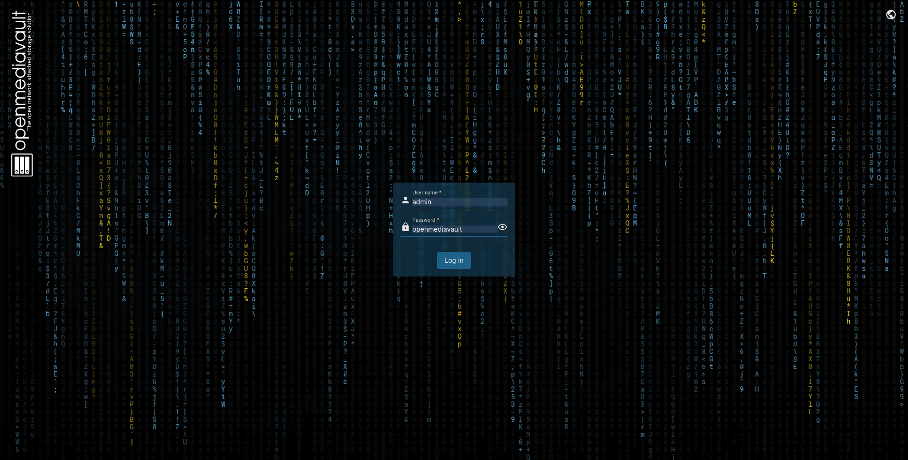

[](https://github.com/trifoil/HOMESERV/blob/main/README.fr.md)


# HOMESERV
Home server with VPN

## Objectives

Homeserver with VPN install for a small amount of users, small NAS server.

* OpenMediaVault
* Wireguard
* Home Assistant

## Setup OMV6

Download the ISO from the official website :

https://www.openmediavault.org/download.html

Burn it on a usb stick (or boot it from the network), and install it on your machine.

Once it is done, you can log in with the username ```admin``` and password ```openmediavault``` :



You can setup different accounts that will be able to use your server. 

You also can set up the partitions that you will use to store data.

You can use Gparted if like me you only had one drive available on your machine and forgot to leave an empty partition.

Once it is done, you can go to the next step.

## Setup WireGuard

### Install wireguard and create a key pair

Update your server and install wireguard :

```
sudo apt update && apt upgrade && apt install wireguard -y
```

Create a private key for the server :
```
wg genkey | sudo tee /etc/wireguard/private.key
```
Remove the users right on the keys (except root account) :
```
sudo chmod go= /etc/wireguard/private.key
```
A copy of the output is also stored in the ```/etc/wireguard/private.key```.

Create a public key for the server :
```
sudo cat /etc/wireguard/private.key | wg pubkey | sudo tee /etc/wireguard/public.key
```
the ```|``` (pipe) operator chains the three commands that 
* reads the private key file and outputs it to the standard output stream
* takes the output from the first command as its standard input and processes it to generate a public key
* takes the output of the public key generation command and redirects it into the file named /etc/wireguard/public.key

Copy the output where you can find it, because it is the pubkey to connect to the server.

### IPV4 and IPV6 setup

Follow both steps if both needed 

1) If you want to use IPv4
   
3) If you want to use IPv6

### Wireguard Server Configuration File creation


### Wireguard's Server's Configuration


### Wireguard's Server's Firewall Configuration


### Wireguard peer configuration


### Adding Peer' Pubkey to the WireGuard Server


### Wireguard Peer Connection to the Tunnel


## Setup Home Assistant

## Sources

https://wiki.omv-extras.org/doku.php?id=omv6:new_user_guide

https://www.digitalocean.com/community/tutorials/how-to-set-up-wireguard-on-debian-11

